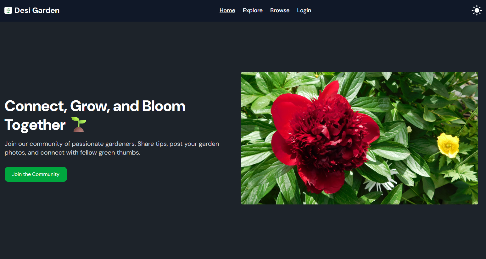

# 🌿 Garden Tips Hub

🔗 **Live Site URL**: [https://banana-project-5ac10.web.app/](https://banana-project-5ac10.web.app/)

---

## 📋 Project Description

**Garden Tips Hub** is a full-stack gardening tips platform where users can explore gardening techniques, share their own tips, and interact with other passionate gardeners. The site supports authentication, CRUD functionalities, filtering, theming, and user-specific experiences. Built with React, Firebase, Tailwind CSS, and MongoDB.

---

## ✨ Features

- 🔐 **Authentication System**

  - Email/password and Google login with Firebase.
  - Protected routes: Share Tip, My Tips, and Tip Details.
  - Password validation on registration (8+ chars, uppercase, lowercase, special char)
  - Displays user photo and name upon login, with logout on click.

- 🔐 \*\* Follow this

  - Sometimes you need to refresh a few times to show the user photo
  - Alert will be show if password criteria isn't met

- 🏠 **Home Page**

  - Image slider/banner with 3+ slides using SwiperJS.
  - Featured Gardeners (6 active profiles from database).
  - Top Trending Tips (shows 6 tips from database) .
  - Two additional Welcome and NewsLetter Section is Added.

- 🧑‍🌾 **Gardeners Section**

  - Shows all gardeners with name, age, gender, status, experience, image, and tip count.

- 🌱 **Share a Garden Tip (Private Route)**

  - Form with title, topic, level, description, category, availability.
  - Saves data to the database with success feedback.

- 📁 **My Tips (Private Route)**

  - update, or delete user’s own tips.
  - Confirmation before deletion.
  - Pre-filled update form with validation.

- 🔍 **Browse Tips**

  - Public tips shown in a table format.
  - Includes filter by difficulty level.
  - “See More” button navigates to Tip Details page.

- 🧾 **Tip Details Page**

  - Full details of a tip shown.
  - Clicking like button will update the like

- 🌘 **Dark/Light Mode**

  - Toggle button in navbar to switch theme modes.

- ❌ **404 Not Found Page**

  - page for invalid routes.

- ⏳ **Loading Spinner**

  - Shown while fetching data to enhance UX.

- 💬 **Toast/SweetAlert**

  - User feedback for success or error messages during login, register, CRUD operations.

- 🎁 **Bonus Features**
  - Integrated `react-awesome-reveal` for subtle animations.
  - Integrated `react-tooltip` for additional UI hints.
  - Integrated `react-simple-typewriter` in the Welcome section

---

## 🚫 Not Included

- ❌ Lottie React integration (optional feature not implemented).

---

## 🔧 Tech Stack

- React + React Router DOM
- Firebase Authentication
- Express.js & MongoDB (Backend)
- Tailwind CSS
- SwiperJS
- React Tooltip, React Awesome Reveal

---

## 📷 Navbar Overview

- Logo on the left
- Navigation Links: Home | Explore Gardeners | Browse Tips | Share Tip (Private) | My Tips (Private) | Login/Signup
- User’s Photo shown after login; clicking shows Logout
- Responsive, mobile-friendly design

---

## 📞 Footer Overview

- Includes Contact Info, Terms & Conditions, Social Media Links
- Matches site's color scheme and font
